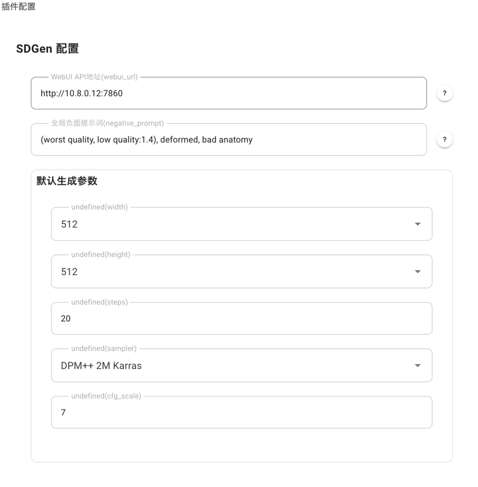

# helloworld

AstrBot 用于图片生成的插件

使用Stable Diffusion WebUI的API进行图片生成

## 用法
### 安装插件，对插件进行配置

- WebUI API地址： HTTP/HTTPS协议 + Stable Diffusion WebUI所在的IP + 端口号
- 全局负面提示词，通常无需修改，也可自己定义
- 用于生成图像的相关参数
  - 图像尺寸
    - 长度
    - 宽度
  - 采样步数
  - 采样方法
  - 提示词权重（决定了模型在生成图像时，对提示词的遵循程度）

    - 值较低（如 1-3）：图像更随机，可能会偏离提示词描述，但创造性更高。
    - 值较高（如 10-15）：图像更严格遵循提示词，但可能导致细节过度锐化或不自然。
    - 一般推荐范围：7-12 之间，默认通常是 7 或 8。
### 关于Stable Diffusion WebUI的部署建议
1. 克隆仓库
```bash
git clone https://github.com/AUTOMATIC1111/stable-diffusion-webui
cd stable-diffusion-webui
```

2. 检查python版本
<span style="color:red">（不要直接运行webui.sh)</span>

```bash
python -V
```
如果python版本高于3.10，例如3.11、3.12、3.13，请使用conda（anaconda或miniconda）或者mamba创建环境（可能也可以用pyenv设置，暂未验证）
```bash
conda create -n webui python=3.10
conda activate webui
# 取消激活时使用 conda deactivate
conda install pip
```
3. 安装依赖
```bash
pip install -r requirements.txt
```
4. 首次运行，会安装大量模型、依赖等，需要一段时间
```bash
./webui.sh
```
5. 安装插件（可选）
- 汉化插件 https://github.com/hanamizuki-ai/stable-diffusion-webui-localization-zh_Hans.git 或 https://github.com/VinsonLaro/stable-diffusion-webui-chinese
- 超分辨率插件 https://github.com/Coyote-A/ultimate-upscale-for-automatic1111
- 提示词插件 https://github.com/Physton/sd-webui-prompt-all-in-one/tree/main
6.以API方式启动webui
```bash
./webui.sh --listen --port 7860 --api      # 带webui的方式启动
#./webui.sh --listen --port 7860 --nowebui # 不带webui，仅API方式启动
```
# 支持
QQ： 1259085392
- 请尽可能自己debug，实在无法解决的问题再寻求帮助。
- 任何代码方面问题，请随时发issues

[帮助文档](https://astrbot.soulter.top/center/docs/%E5%BC%80%E5%8F%91/%E6%8F%92%E4%BB%B6%E5%BC%80%E5%8F%91/
)
